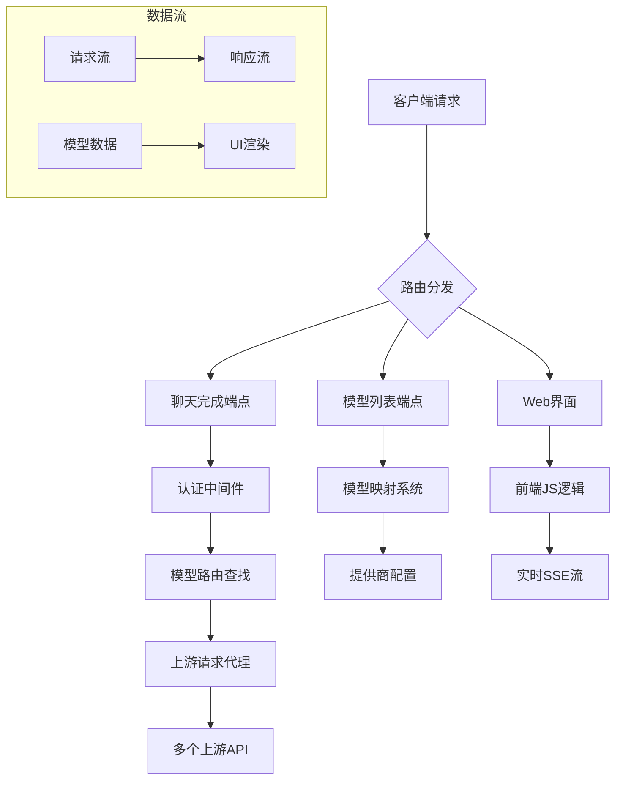

# 🚀 AI Gateway Cloudflare Worker v3.0 - 智能API网关

<div align="center">


**✨ 一个能自我配置的智能API网关 - 让AI调用变得简单如呼吸 ✨**

*"不再需要关心模型来自哪里，只需告诉它你想要什么"*

[快速开始](#-快速开始-懒人专属) | [技术原理](#-技术原理详解) | [使用教程](#-详细使用教程) | [开发指南](#-开发者扩展指南)

</div>

## 📋 目录
- [🎯 项目简介](#-项目简介)
- [🌟 核心特性](#-核心特性)
- [🚀 快速开始](#-快速开始-懒人专属)
- [🛠️ 详细使用教程](#-详细使用教程)
- [🧠 技术原理详解](#-技术原理详解)
- [🏗️ 架构设计](#-架构设计)
- [🔧 开发者扩展指南](#-开发者扩展指南)
- [📊 项目现状](#-项目现状)
- [🎯 适用场景](#-适用场景)
- [🔮 未来规划](#-未来规划)
- [📁 项目结构](#-项目结构)
- [🤝 贡献指南](#-贡献指南)
- [📄 开源协议](#-开源协议)

## 🎯 项目简介

> 💡 **哲学思考**：在AI爆炸的时代，我们是否应该让技术适应人类，而不是人类适应技术？

这是一个革命性的**单文件Cloudflare Worker智能网关**，它不再仅仅是一个简单的代理，而是一个具备自我意识的API路由大脑！想象一下，你有一个智能助手，它知道所有AI服务的"电话号码"，你只需要说出想找的人（模型），它自动帮你转接到正确的地方。

### 🎪 生动比喻
- **传统方式**：像在陌生城市找餐厅，需要知道每个餐厅的具体地址
- **我们的方案**：像使用美食APP，只需要输入想吃的菜名，APP自动推荐并导航到最佳餐厅

## 🌟 核心特性

| 特性 | 描述 | 优势 |
|------|------|------|
| 🧠 **智能路由** | 自动根据模型名称路由到正确上游 | 无需记忆复杂API端点 |
| 📚 **统一目录** | 聚合所有提供商的模型列表 | 一站式模型发现 |
| 🎯 **OpenAI兼容** | 完全兼容OpenAI API格式 | 无缝接入现有工具 |
| ⚡ **无服务器** | 基于Cloudflare Workers | 全球加速，按量付费 |
| 🔧 **自配置** | 启动时自动构建模型映射 | 免手动配置 |
| 🎨 **友好UI** | 内置交互式测试界面 | 开箱即用 |

## 🚀 快速开始 (懒人专属)

### ⚡ 一键部署

[](https://deploy.workers.cloudflare.com/?url=https://github.com/lzA6/g4f.dev-2api-cfwork)

**或者手动部署：**

1. **克隆仓库**
   ```bash
   git clone https://github.com/lzA6/g4f.dev-2api-cfwork.git
   cd g4f.dev-2api-cfwork
   ```

2. **安装Wrangler CLI**
   ```bash
   npm install -g wrangler
   ```

3. **登录Cloudflare**
   ```bash
   wrangler login
   ```

4. **部署！**
   ```bash
   wrangler deploy
   ```

🎉 **恭喜！你的智能AI网关已经上线！**

### 🔑 获取连接信息
部署完成后，你会获得一个类似这样的URL：
```
https://your-worker.your-account.workers.dev
```

**重要配置信息：**
- **API Base URL**: `https://your-worker.your-account.workers.dev/v1`
- **API Key**: `1` (是的，就是这么简单！)
- **模型名称**: 访问你的worker根路径查看可用模型

## 🛠️ 详细使用教程

### 📱 方法一：通过Web界面（小白友好）

1. 访问你的Worker URL（如：`https://your-worker.your-account.workers.dev`）
2. 你会看到一个漂亮的控制面板
3. 从下拉菜单中选择一个模型
4. 输入你的问题
5. 点击"发送"按钮
6. 🎊 见证奇迹的时刻！

### 🔌 方法二：通过API（开发者首选）

#### 获取模型列表
```bash
curl "https://your-worker.your-account.workers.dev/v1/models" \
  -H "Authorization: Bearer 1"
```

#### 发送聊天请求
```bash
curl "https://your-worker.your-account.workers.dev/v1/chat/completions" \
  -H "Content-Type: application/json" \
  -H "Authorization: Bearer 1" \
  -d '{
    "model": "gpt-4o-mini",
    "messages": [
      {
        "role": "user",
        "content": "你好，请介绍一下自己"
      }
    ],
    "stream": true
  }'
```

### 🛠️ 方法三：集成到第三方应用

#### 配置OpenAI客户端
```python
# Python示例
from openai import OpenAI

client = OpenAI(
    base_url="https://your-worker.your-account.workers.dev/v1",
    api_key="1"
)

response = client.chat.completions.create(
    model="gpt-4o-mini",
    messages=[{"role": "user", "content": "Hello!"}]
)
```

## 🧠 技术原理详解

### 🏗️ 核心架构图

```
┌─────────────────┐    ┌──────────────────┐    ┌─────────────────┐
│   客户端请求     │    │  智能网关Worker   │    │  上游AI提供商    │
│                 │    │                  │    │                 │
│ OpenAI格式请求  │───▶│ 1. 验证API密钥    │───▶│ 实际AI服务      │
│ model: "xxx"    │    │ 2. 查找模型路由   │    │                 │
└─────────────────┘    │ 3. 转发请求       │    └─────────────────┘
                       │ 4. 返回响应       │
┌─────────────────┐    │                  │    ┌─────────────────┐
│   用户界面       │    │ 🧠 模型映射表     │    │ 另一个AI提供商   │
│ 交互式测试面板   │◀──▶│ gpt-4o-mini → A  │───▶│                 │
└─────────────────┘    │ llama3     → B    │    └─────────────────┘
                       └──────────────────┘
```

### 🔧 关键技术解析

#### 1. 🗺️ 模型-提供商映射系统 (`MODEL_PROVIDER_MAP`)

```javascript
// 这是一个全局Map对象，存储模型到提供商的映射关系
// 结构: Map<modelId, {providerId, upstreamHost, chatPath}>
MODEL_PROVIDER_MAP = new Map([
  ['gpt-4o-mini', {
    providerId: 'api.airforce',
    upstreamHost: 'api.airforce',
    chatPath: '/v1/chat/completions'
  }],
  // ... 更多模型映射
]);
```

**技术要点**：
- **数据结构**: 使用ES6 Map，查找时间复杂度O(1)
- **缓存策略**: Worker启动时构建，避免重复请求
- **容错处理**: 使用Promise.allSettled，单个提供商失败不影响整体

#### 2. 🚦 智能路由算法

```javascript
async function handleChatCompletionRequest(request) {
  // 1. 解析请求体，提取model字段
  const requestBody = await request.json();
  const modelId = requestBody.model;
  
  // 2. 在映射表中查找对应的提供商信息
  const providerInfo = MODEL_PROVIDER_MAP.get(modelId);
  
  // 3. 构建上游请求URL和headers
  const upstreamUrl = `https://${providerInfo.upstreamHost}${providerInfo.chatPath}`;
  
  // 4. 转发请求并返回响应
  return await fetch(upstreamRequest);
}
```

#### 3. 🎨 响应式UI组件

前端界面使用纯HTML/CSS/JS实现，包含：
- **模型选择器**: 动态加载的`<select>`元素
- **实时聊天**: 使用Server-Sent Events (SSE) 实现流式响应
- **复制功能**: 基于Clipboard API的一键复制

## 🏗️ 架构设计

### 📊 系统组件图



### 🔄 请求处理流程

1. **接收请求** → 2. **路径路由** → 3. **认证验证** → 4. **模型解析** → 5. **上游转发** → 6. **响应返回**

## 🔧 开发者扩展指南

### 🎯 添加新的AI提供商

想要添加新的AI服务？超级简单！

```javascript
// 在 PROVIDER_CONFIG 中添加新条目
const PROVIDER_CONFIG = {
  // ... 现有配置
  
  'my-new-provider': {  // 🔑 提供商ID（唯一标识符）
    name: '我的新AI服务', // 📝 显示名称
    upstreamHost: 'api.my-new-ai.com', // 🌐 上游主机地址
    modelsPath: '/v1/models', // 📋 模型列表端点（可选）
    chatPath: '/v1/chat/completions' // 💬 聊天端点
  }
  
  // 或者对于硬编码模型的提供商：
  'simple-provider': {
    name: '简单AI服务',
    upstreamHost: 'simple.ai',
    models: ['model-a', 'model-b'], // 🎯 直接指定模型
    chatPath: '/api/chat'
  }
};
```

### 🔄 扩展模型解析逻辑

如果需要处理特殊格式的模型列表响应：

```javascript
// 在 buildModelProviderMap 函数中添加新的解析逻辑
if (providerId === 'special-provider') {
  // 自定义解析逻辑
  models = data.specialFormat.models.map(m => m.modelId);
}
```

### 🎨 自定义UI主题

修改CSS变量即可改变整体主题：

```css
:root {
  --bg-color: #你的背景色;
  --primary-color: #你的主色调;
  --text-color: #你的文字颜色;
}
```

## 📊 项目现状

### ✅ 已完成功能

| 功能模块 | 状态 | 完成度 |
|----------|------|--------|
| 核心路由系统 | ✅ 完成 | 100% |
| 模型自动发现 | ✅ 完成 | 100% |
| 多提供商支持 | ✅ 完成 | 100% |
| Web交互界面 | ✅ 完成 | 100% |
| OpenAI兼容 | ✅ 完成 | 100% |
| 流式响应 | ✅ 完成 | 100% |

### 🚧 待完善功能

| 功能 | 优先级 | 预计难度 | 描述 |
|------|--------|----------|------|
| 请求重试机制 | 🔴 高 | ⭐⭐ | 上游失败时自动重试其他提供商 |
| 负载均衡 | 🔴 高 | ⭐⭐⭐ | 同模型多提供商时的智能分配 |
| 使用量统计 | 🟡 中 | ⭐⭐ | API调用次数和成功率统计 |
| 缓存优化 | 🟡 中 | ⭐⭐ | 响应缓存提升性能 |
| 速率限制 | 🟢 低 | ⭐ | 防止API滥用 |

## 🎯 适用场景

### 🌟 完美匹配的使用案例

1. **🚀 个人开发者**
   - 快速搭建AI测试环境
   - 多模型对比测试
   - 学习和实验AI应用

2. **🏢 中小企业**
   - 成本可控的AI服务接入
   - 避免供应商锁定
   - 快速原型开发

3. **🎓 教育研究**
   - 学生AI学习平台
   - 多模型性能对比
   - 算法研究测试

### ⚠️ 使用限制

1. **性能依赖**: 依赖上游API的响应速度
2. **功能限制**: 仅支持聊天完成接口
3. **稳定性**: 受上游服务可用性影响

## 🔮 未来规划

### 🎯 技术演进路线

**阶段一：基础稳固** (当前)
- ✅ 核心路由功能
- ✅ 基础UI界面
- ✅ 多提供商支持

**阶段二：功能增强** (短期目标)
- 🔄 请求重试和降级
- 🔄 基础监控统计
- 🔄 文档完善

**阶段三：智能优化** (中期目标)
- 🕐 智能负载均衡
- 🕐 预测性缓存
- 🕐 自适应路由

**阶段四：生态建设** (长期目标)
- 🌟 插件系统
- 🌟 市场生态
- 🌟 企业特性

## 📁 项目结构

```
g4f.dev-2api-cfwork/
├── 📄 README.md                    # 项目说明文档 (就是这个文件!)
├── 🔧 wrangler.toml                # Cloudflare Workers配置
├── 📦 package.json                 # 项目依赖配置
└── 🚀 src/
    └── 📄 worker.js                # 🎯 核心Worker代码 (单文件架构!)

# 🗂️ 虚拟文件结构 (代码内组织)
worker.js 内部结构:
├── ⚙️ 硬编码配置区域
│   ├── WORKER_API_KEY
│   └── PROVIDER_CONFIG
├── 🧠 智能核心系统
│   ├── MODEL_PROVIDER_MAP
│   └── buildModelProviderMap()
├── 🚀 Worker主入口
│   └── fetch() 事件处理器
├── 🔌 API请求处理器
│   ├── handleChatCompletionRequest()
│   └── handleModelsRequest()
└── 🎨 UI界面处理器
    └── handleGuiRequest()
```

## 🛠️ 技术栈评级

| 技术 | 使用场景 | 难度 | 评级 | 说明 |
|------|----------|------|------|------|
| Cloudflare Workers | 无服务器平台 | ⭐⭐ | 🌟🌟🌟🌟🌟 | 边缘计算，全球部署 |
| ES6 Modules | JavaScript模块化 | ⭐ | 🌟🌟🌟🌟 | 现代JS标准 |
| Map数据结构 | 模型映射存储 | ⭐ | 🌟🌟🌟🌟 | 高效键值查找 |
| Fetch API | HTTP请求处理 | ⭐⭐ | 🌟🌟🌟🌟 | 现代网络请求标准 |
| Server-Sent Events | 实时数据流 | ⭐⭐⭐ | 🌟🌟🌟 | 轻量级实时通信 |
| CSS Variables | 主题系统 | ⭐ | 🌟🌟🌟🌟 | 动态样式管理 |

## 🔍 技术深度解析

### ⚡ 高级代码技巧

#### 1. 智能错误处理
```javascript
// 使用 Promise.allSettled 而不是 Promise.all
// 这样即使某个提供商失败，也不会影响其他提供商的模型发现
await Promise.allSettled(fetchPromises);
```

#### 2. 多格式响应解析
```javascript
// 智能适应不同上游API的响应格式
if (Array.isArray(data)) {
    models = data.map(m => m.id || m.name).filter(Boolean);
} else if (data.data && Array.isArray(data.data)) {
    models = data.data.map(m => m.id).filter(Boolean);
} else if (data.models && Array.isArray(data.models)) {
    models = data.models.map(m => m.name).filter(Boolean);
}
```

#### 3. 流式响应处理
```javascript
// 使用 ReadableStream 处理SSE流
const reader = response.body.getReader();
while (true) {
    const { done, value } = await reader.read();
    if (done) break;
    // 实时处理数据块...
}
```

## 🤝 贡献指南

我们热烈欢迎各种形式的贡献！🎉

### 💡 如何贡献

1. **报告问题**: 发现bug？请创建Issue
2. **功能建议**: 有好点子？欢迎讨论！
3. **代码贡献**: 提交Pull Request
4. **文档改进**: 帮助完善文档
5. **测试帮助**: 协助测试和验证

### 🎯 贡献者公约

- 🙏 尊重每个人的意见
- 💬 友好沟通讨论
- 🚀 鼓励创新想法
- 🌟 认可每个贡献的价值

---

<div align="center">

## 🎊 感谢使用！

**如果这个项目对你有帮助，请给个⭐Star支持一下！**

> 💫 *"技术应该让生活更简单，而不是更复杂。"* - 本项目哲学

**快乐编码！** 🚀✨

</div>
